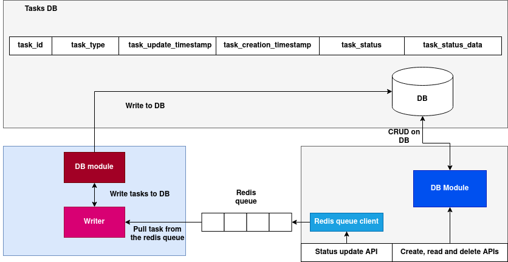

# Global tasks DB

Global tasks DB is used for the system tasks that execute asynchronously, some examples of these tasks include creating Cluster infrastructure, adding nodes, allocating, de-allocating blocks, creating a vDAG etc - these tasks cannot be fulfilled in the context of a HTTP request, thus they are executed asynchronously. 

The modules that make use of Global tasks DB first creates a task entry in the DB and returns the task ID immediately to the caller/user and then starts processing the task in the background, once the task completes/fails the corresponding status and the output will be updated in the Global tasks DB.

## Architecture:

The writer and CRUD services can be scaled based on the load.




## Schema of the Global task DB:

### 1. `task_id` (`str`)
- A unique identifier for the task.
- Generated using `uuid.uuid4()`.
- Ensures every task has a distinct ID.

### 2. `task_data` (`Dict[str, Any]`)
- Contains any data relevant to the task.
- May include inputs, configurations, or additional information for processing.
- Defaults to an empty dictionary.

### 3. `task_type` (`str`)
- Specifies the type of task.
- Used for classification and task management.
- Defaults to an empty string.

### 4. `task_update_timestamp` (`int`)
- Tracks the last time the task was updated.
- Initialized with the current UTC timestamp using `int(datetime.utcnow().timestamp())`.
- Useful for monitoring and logging.

### 5. `task_create_timestamp` (`int`)
- Records the creation time of the task.
- Similar to `task_update_timestamp`, but it remains constant once set.
- Provides a reliable creation timestamp.

### 6. `task_status` (`str`)
- Represents the current state of the task.
- Defaults to `"pending"`.
- Other possible statuses include `"in_progress"`, `"completed"`, or `"failed"`.

### 7. `task_status_data` (`Dict[str, Any]`)
- Stores additional metadata or information about the task's current status.
- May contain error messages, progress details, or intermediate results.
- Initialized as an empty dictionary.


Python data-class of the schema:

```python
@dataclass
class GlobalTask:
    task_id: str = field(default_factory=lambda: str(uuid.uuid4()))
    task_data: Dict[str, Any] = field(default_factory=dict)
    task_type: str = field(default_factory=str)
    task_update_timestamp: int = field(default_factory=lambda: int(datetime.utcnow().timestamp()))
    task_create_timestamp: int = field(default_factory=lambda: int(datetime.utcnow().timestamp()))
    task_status: str = field(default='pending')
    task_status_data: Dict[str, Any] = field(default_factory=dict)
```

## Global tasks DB APIs:

### 1. API to create a task (Used by the internal systems):

**Description:**  
Creates a new task with the provided data.

**Endpoint:**  
`POST /task`

**Curl Command:**  
```bash
curl -X POST http://<server-url>:5000/task \
     -H "Content-Type: application/json" \
     -d '{
           "task_data": {"key": "value"},
           "task_type": "example_task_type",
           "task_status": "pending",
           "task_status_data": {"info": "status info"}
         }'
```

### 2. API to fetch the task data using task ID:

## Get Task by ID

**Description:**  
Fetches the details of a task using its `task_id`.

**Endpoint:**  
`GET /task/<task_id>`

**Curl Command:**  
```bash
curl -X GET http://<server-url>:5000/task/<task_id>
```

### 3. Update Task (Used by the internal systems):

**Description:**  
Updates the details of a specific task using its `task_id`.

**Endpoint:**  
`PUT /task/<task_id>`

**Curl Command:**  
```bash
curl -X PUT http://<server-url>:5000/task/<task_id> \
     -H "Content-Type: application/json" \
     -d '{
           "task_data": {"updated_key": "updated_value"},
           "task_status": "in_progress"
         }'
```

### 4. Delete Task

**Description:**  
Deletes a specific task using its `task_id`.

**Endpoint:**  
`DELETE /task/<task_id>`

**Curl Command:**  
```bash
curl -X DELETE http://<server-url>:5000/task/<task_id>
```

### 5. Get tasks list by task type and the task status:

## Get Tasks by Type and Status

**Description:**  
Fetches a list of tasks filtered by `task_type` and optionally by `task_status`.

**Endpoint:**  
`GET /tasks`

**Curl Command:**  
```bash
curl -X GET "http://<server-url>:5000/tasks?task_type=vdag_creation&task_status=pending"
```

## Updating the task data:
Updating the task status and data is an asynchronous operation, status updates made by the services are eventually updated in the DB, here is an API to update the status and the output data of the task:

### Endpoint
**POST** `/task_update`

### Description
Pushes a task update with a given `task_id`, `status`, and optional `task_status_data` to the system.

### Request Format

#### Headers
- `Content-Type: application/json`

#### Body Parameters
| Parameter         | Type   | Required | Description |
|------------------|--------|----------|-------------|
| `task_id`       | string | Yes   | Unique identifier of the task |
| `status`        | string | Yes   | Updated status of the task |
| `task_status_data` | object | No  | Additional metadata about the task status |

#### CURL example:
```bash
curl -X POST http://your-api-host/task_update \
     -H "Content-Type: application/json" \
     -d '{
           "task_id": "12345",
           "status": "completed",
           "task_status_data": {}
         }'
```


## Supported task types:

1. "vdag_creation": vDAG creation task.
2. "block_alloc": Block allocation task
3. "cluster_infra_creation": Cluster infra creation task.
4. "cluster_infra_remove": Cluster infra removal task.
5. "node_addition": Adding a node to the cluster.
6. "node_removal": Removing a node from the cluster.


